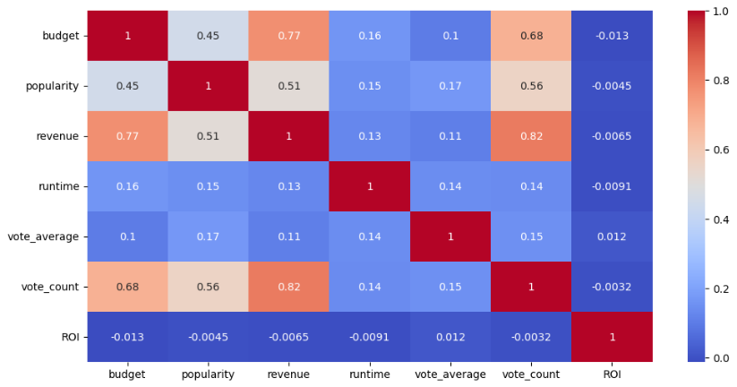

# Movie Recommendation and ROI models

This represents an AI tool that is a content-based filtering method for movie recommendations to suggest movies to users based on the content of the movies and the preferences of the users.

The system analyzes the content of the movies, such as their genre, keywords, the mood of the users, and cult classics per genre, and uses this information to determine which movies are similar to each other.

This tool provides recommendations that users predict future preferences by using their past experiences and preferences. These services use very sophisticated systems to recommend the best items to their users to make their experiences great. 

Prediction models for Budget vs Revenue based upon popularity of the movies are also defined.

 

## Content-based recommendation

1. Movie recommendaions based upon Keywords  

User gives a Movie Title as an input and based upon the keywords associated, the tool returns top 10 movies.

2.  Movie recommendations for the user based on different genres based upon votes.
    
If a user has watched and liked several action movies, the recommendation system might suggest other action movies that have similar content and order by maximum votes received.

3.  Movie Recommendations for the user on the basis of the mood.

Assuming the mapping of an user's mood per genre, the Tool recommends the movie ordered by votes 
*   Happy mood mapped to 'Comedy'
*   Sad mood mapped to 'Drama'
*   Excited mood mapped to 'Action'
*   Romantic mood mapped to 'Romance'
*   Scared mood mapped to 'Horror'

4. Recommendations for cult-classics (High Rating, Low Budget) based on different genres.

Assuming movies of rating 7.5 and votes atleast above 100 defined the cult-classics recommended movies on the genre provided by the user.
  

 

## Analysis of various factorsfor ROI (Revenue vs Budget)

* Above heeat-map shows the budegt, revenue and popularity of the movies are highly correlated. 
* Also vote counts for high ratings are being gathered for high budget movies. 

 

## Machine Learning

Prediction models

Following prediction models are ussed in our analysis

* AdaBoostRegressor
* GradientBoostingRegressor

The above models were used to define a better accuracy of revenue predicted for a movie of certain budget compared to the true historical revenue.

AdaBoost is the first designed boosting algorithm with a particular loss function. On the other hand, Gradient Boosting is a generic algorithm that assists in searching the approximate solutions to the additive modelling problem. This makes Gradient Boosting more flexible than AdaBoost.

 
Source Data

The source data files contain metadata for 45,000 movies listed in the Full MovieLens Dataset. The dataset consists of movies released on or before July 2017. Data points include plot keywords, budget, revenue, release dates, languages, production companies, countries, TMDB vote counts and vote averages.

The source data-set is a comma seperated (csv) file. 

Cleaned up the columns not used in deriving recommendations and prediction analysis like id', 'original_title', 'production_companies', 'production_countries', 'status', 'tagline'.
Also removed an NA and converted the date fields like Release Date to datatime format.

 
Train and Test data for models

Training and Test data set is divided in random state to define the y set as 'revenue' and X against 'Budget' 'popularity'

 

AdaBoostRegressor Metrics:

    MSE: 8345049776798292.0
    RMSE: 91351243.98057364
    R2 Score: -0.8133629640768927

GradientBoostingRegressor Metrics:

    MSE: 1659001474115129.5
    RMSE: 40730841.80464638
    R2 Score: 0.6395022305470832

Based on the results, it can be observed that the GradientBoostingRegressor model outperforms the AdaBoostRegressor model in terms of MSE, RMSE, and R2 Score. 

The MSE and RMSE values for the GradientBoostingRegressor model are significantly lower than the AdaBoostRegressor model, indicating that the GradientBoostingRegressor model provides more accurate predictions. 

The R2 Score for the GradientBoostingRegressor model is also significantly higher than the AdaBoostRegressor model, indicating that the GradientBoostingRegressor model explains more variance in the data.

 

## Conclusion

The tool provides recommendation for movies based upon Keywords, genere, user's mood and cult-classica per genre.

An analysis is performed for the ROI of budget vs revenue impact on the voting scores.

This tool also defines a prediction model to find what factors (budget and popularity vs revenue) correlate with the highest Return on Investment.

 

## Next steps

* Interface this tool in AWS for an interactive Chat Bot using SageMaker, Lambda function and Lex capabilties.

* Enhance the tool with live data-set of user's history to provide recommendations using search history, keywords, and movie reviews.

 

## References 

https://www.kaggle.com/datasets/rounakbanik/the-movies-dataset?datasetId=3405
